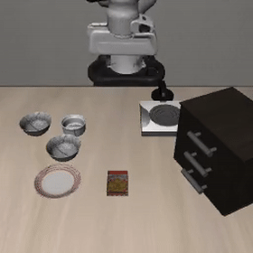
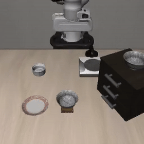

# Technical Assessment: Robotics Research Intern — Foundation Models & VLAs

> **⚠️ IMPORTANT — READ BEFORE YOU START ⚠️**
>
> **Please read this entire document carefully before beginning any work.** This README contains critical information about the task requirements, environment setup, training guidelines, expected deliverables, and compute recommendations. Skipping sections may lead to wasted time, broken setups, or missing deliverables. A thorough read-through will ensure a smooth experience and help you avoid common pitfalls.

## Overview

This assessment evaluates your ability to work with Vision-Language-Action (VLA) models for robotic manipulation. You will fine-tune **SmolVLA** (a 450M-parameter VLA) on the **LIBERO** simulation benchmark, evaluate it against a reference checkpoint, conduct a controlled ablation study, and produce a video of your robot performing tasks in simulation.

**Time limit:** 10 days from receipt
**Compute requirements:** Designed to run on **free GPU resources** — Google Colab (T4 16GB) or Kaggle (T4/P100 16GB). No paid compute is required.

<table>
<tr>
<td align="center" colspan="2"><b>SmolVLA performing LIBERO spatial manipulation tasks</b></td>
</tr>
<tr>
<td align="center"></td>
<td align="center"></td>
</tr>
<tr>
<td align="center" colspan="2"><i>Fine-tuned SmolVLA controlling a robot arm to manipulate tabletop objects from language instructions</i></td>
</tr>
</table>

---

## Background

### What is a VLA?

A **Vision-Language-Action (VLA)** model is a neural network that takes in visual observations (camera images) and a natural language instruction (e.g., "pick up the red mug"), and outputs robot actions (joint velocities, end-effector positions, or gripper commands). VLAs are the robotics equivalent of multimodal LLMs — they unify perception, language understanding, and motor control in a single model.

The VLA landscape has evolved rapidly:

| Model | Params | Approach | Key Innovation |
|-------|--------|----------|---------------|
| RT-2 (Google, 2023) | 55B | Autoregressive, discrete actions | First large-scale VLA |
| OpenVLA (Stanford, 2024) | 7B | Autoregressive, discrete action tokens | Open-source, LoRA fine-tuning |
| π0 (Physical Intelligence, 2024) | 3B | Flow matching, continuous actions | Action chunking + flow matching |
| OpenVLA-OFT (Stanford, 2025) | 7B | Parallel decoding, continuous actions | 26x faster than OpenVLA |
| **SmolVLA (Hugging Face, 2025)** | **0.45B** | **Flow matching, action chunking** | **87% LIBERO at 15x smaller** |

### SmolVLA Architecture

SmolVLA has two main components:

1. **VLM Backbone (~350M params, frozen during fine-tuning)**
   - Vision encoder: SigLIP, compressed to only 64 visual tokens per frame
   - Language model: SmolLM2-based decoder
   - Only the first 16 of 32 layers are used (layer skipping for efficiency)

2. **Action Expert (~100M params, trained during fine-tuning)**
   - A compact transformer with interleaved cross-attention and self-attention
   - Uses **flow matching** to generate continuous action trajectories
   - Predicts **50 future actions at once** (action chunking)
   - 10 denoising steps at inference

**Why this matters:** SmolVLA uses flow matching instead of autoregressive token prediction. This means actions are continuous vectors (not discretized into bins), predicted in parallel (not sequentially), and generated as smooth trajectories (not single steps). Understanding this difference is central to this assessment.

### LIBERO Benchmark

**LIBERO** is a benchmark for lifelong robot learning built on robosuite (MuJoCo physics). It provides standardized manipulation tasks with demonstration data.

| Suite | Tasks | What it tests |
|-------|-------|---------------|
| **LIBERO-Spatial** | 10 | Spatial reasoning — same objects, different arrangements |
| LIBERO-Object | 10 | Object generalization — different objects, same layout |
| LIBERO-Goal | 10 | Goal generalization — same scene, different goals |
| LIBERO-Long | 10 | Long-horizon — multi-step tasks |

You will work with **LIBERO-Spatial** (10 tasks, 50 demonstrations each, 500 total).

Each task is a short manipulation episode: the robot must follow a language instruction (e.g., "pick up the black bowl on the left and place it on the plate") within a time limit. Success is binary — the task is either completed or not.

### LeRobot Framework

**LeRobot** is Hugging Face's robotics framework. It provides:
- Standardized dataset format (Parquet + video)
- Training pipeline (`lerobot-train`)
- Evaluation pipeline (`lerobot-eval`)
- Model implementations (SmolVLA, ACT, Diffusion Policy, etc.)

You will use LeRobot for everything in this assessment.

---

## Task Description

### Part A: Environment Setup & Fine-Tuning (35 points)

1. **Set up the environment:**
   - Install LeRobot with LIBERO support
   - Verify LIBERO simulation runs headlessly (`MUJOCO_GL=egl`)
   - Download the SmolVLA base checkpoint (`lerobot/smolvla_base`)
   - Download the LIBERO dataset (`HuggingFaceVLA/libero`)

2. **Set up Weights & Biases (Wandb) for experiment tracking:**
   - Create a free Wandb account at [wandb.ai](https://wandb.ai)
   - Log all training runs (loss, learning rate, gradient norm, etc.)
   - Your Wandb dashboard will be used as evidence of your training process
   - LeRobot has built-in Wandb support:
     ```bash
     --wandb.enable=true --wandb.project=smolvla-libero
     ```

3. **Fine-tune SmolVLA on LIBERO-Spatial:**
   - Start from the `lerobot/smolvla_base` pre-trained checkpoint
   - Use the LeRobot training pipeline with Wandb logging enabled
   - Target: at least 20,000 training steps (adjust based on convergence)
   - Save checkpoints at regular intervals

4. **Download and prepare the reference checkpoint:**
   - Download `HuggingFaceVLA/smolvla_libero` (officially fine-tuned on all LIBERO suites)
   - This is your **reference baseline** for comparison

**Deliverables for Part A:**
- Working fine-tuning commands (must be fully reproducible)
- Wandb project link (set project to public or share with reviewer)
- Final checkpoint (or HuggingFace Hub link)
- Description of any setup issues and how you resolved them

---

### Part B: Evaluation, Benchmarking & Video (30 points)

1. **Evaluate both models on LIBERO-Spatial:**
   - Your fine-tuned SmolVLA
   - The reference checkpoint (`HuggingFaceVLA/smolvla_libero`)
   - Run **10 evaluation episodes per task** (10 tasks × 10 = 100 total per model)

2. **Measure inference performance:**
   - Inference latency (ms per action chunk)
   - GPU memory during inference
   - Training time for your fine-tuned model

3. **Record evaluation videos:**
   - Capture simulation videos of your fine-tuned model performing at least **3 different LIBERO-Spatial tasks**
   - Include both **successful and failed** episodes
   - Each video should show the robot's camera view and (if possible) a third-person view
   - Save as MP4 files in `videos/`
   - **Minimum:** 3 task videos (at least 1 success, at least 1 failure)
   - **Ideal:** Videos for all 10 tasks showing representative behavior

   LeRobot's `lerobot-eval` can record videos automatically. You can also capture frames manually:
   ```python
   # During evaluation, capture frames and save as video:
   import imageio
   frames = []
   obs = env.reset()
   for step in range(max_steps):
       action = policy.select_action(obs)
       obs, reward, done, info = env.step(action)
       frames.append(env.render(mode="rgb_array"))
   imageio.mimsave("videos/task_0_success.mp4", frames, fps=20)
   ```

4. **Output results in the required JSON format:**

```json
{
  "model": "smolvla_finetuned | smolvla_reference",
  "libero_suite": "spatial",
  "per_task_success_rate": {
    "task_0": 0.75,
    "task_1": 0.60,
    "task_2": 0.80,
    "task_3": 0.55,
    "task_4": 0.70,
    "task_5": 0.65,
    "task_6": 0.90,
    "task_7": 0.45,
    "task_8": 0.85,
    "task_9": 0.70
  },
  "aggregate_success_rate": 0.695,
  "inference_latency_ms": 85.3,
  "gpu_memory_mb": 4096,
  "training_time_hours": 3.5,
  "training_steps": 20000,
  "batch_size": 8,
  "num_eval_episodes_per_task": 10,
  "checkpoint_path": "path/to/checkpoint",
  "hardware": "NVIDIA T4 16GB",
  "notes": "Any relevant notes"
}
```

**Deliverables for Part B:**
- `results/smolvla_finetuned_results.json` and `results/smolvla_reference_results.json`
- `videos/` folder with simulation recordings (MP4)
- Evaluation scripts/commands used

---

### Part C: Ablation Study & Technical Report (35 points)

This part tests your **experimental methodology and scientific communication**.

#### Ablation Study (15 points)

Choose **one** design dimension to ablate. Train at least **2-3 variants** and evaluate each on LIBERO-Spatial:

| Option | What to vary | Example variants | Why it's interesting |
|--------|-------------|-----------------|---------------------|
| **A. Action chunk size** | Number of predicted future actions | 10, 25, 50 (default) | Tests how horizon length affects flow matching quality |
| **B. VLM layer depth** | How many VLM layers to use | 8, 16 (default), 24 | Tests the information bottleneck between vision-language and action |
| **C. Data efficiency** | Fraction of training demonstrations | 25%, 50%, 100% | Tests how much data SmolVLA needs to learn spatial tasks |
| **D. Training duration** | Number of training steps | 5K, 10K, 20K, 50K | Tests convergence speed and overfitting behavior |

For each variant:
- Log training to Wandb (same project, different run names)
- Save results as `results/ablation_{variant_name}_results.json`

#### Technical Report — Paper Format (20 points)

Submit a **PDF report** (`REPORT.pdf`) written in the style of a short research paper. This is the centerpiece of your submission — it's where we learn how you think.

**Required sections:**

1. **Abstract** (0.5 page)
   - Summarize your objective, approach, key findings, and one takeaway.

2. **Introduction & Background** (0.5-1 page)
   - Brief context on VLAs, SmolVLA, and LIBERO.
   - State clearly what you set out to investigate in your ablation.

3. **Experimental Setup** (0.5-1 page)
   - Hardware, software versions, hyperparameters.
   - Training configuration and any modifications you made.
   - Describe your ablation methodology: what you varied, what you kept constant, why.

4. **Results** (1-2 pages)
   - **Table 1:** Fine-tuned model vs reference — per-task success rates, aggregate, and comparison. Example format:

     | Task | Fine-tuned | Reference | Delta |
     |------|:----------:|:---------:|:-----:|
     | 0    | 30%        | 70%       | -40%  |
     | 1    | 20%        | 90%       | -70%  |
     | ...  | ...        | ...       | ...   |
     | **Overall** | **11%** | **71%** | **-60%** |

   - **Table 2:** Ablation results — all variants compared.
   - **Figures from Wandb:** Include training loss curves, learning rate schedules, and any other relevant plots exported from your Wandb dashboard.
   - **Figures from evaluation:** Per-task bar charts comparing models and/or ablation variants.

5. **Analysis & Discussion** (1-2 pages)
   - Why does the reference model outperform yours? What would close the gap?
   - Ablation analysis: explain *why* your chosen variable affects performance, connecting to SmolVLA's architecture (flow matching, action chunking, VLM features).
   - **Video analysis:** Reference specific moments from your recorded simulation videos. Include frame screenshots. Example: *"In task 3, the robot consistently overshoots the grasp point at timestep ~120 (Figure 4). This suggests the 10-step denoising may be insufficient for fine-grained positioning."*

6. **Proposed Improvement** (0.5 page)
   - One concrete limitation you observed → one specific, technically grounded approach to address it.
   - Must be motivated by YOUR experiments, not a generic literature suggestion.

7. **References**
   - Cite all papers, tools, and resources you used.

**Report guidelines:**
- **Length:** 4-8 pages (including figures and tables, excluding references)
- **Format:** PDF. Use LaTeX, Google Docs, Overleaf, or any tool that produces clean PDFs.
- **Figures:** All plots must have labeled axes, titles, and legends. Export Wandb charts or create your own with matplotlib/seaborn.
- **Writing:** Clear, concise, technical. First person is fine. No filler.

---

## Repository Structure

```
your-submission/
├── README.md                             # How to reproduce your results
├── REPORT.pdf                            # Technical report (paper format) — Part C
├── SUBMISSION.md                         # Filled-in submission template
├── results/
│   ├── smolvla_finetuned_results.json    # Your fine-tuned model evaluation
│   ├── smolvla_reference_results.json    # Reference checkpoint evaluation
│   └── ablation_*.json                   # One file per ablation variant
├── videos/
│   ├── task_0_success.mp4                # Simulation recordings (min 3 tasks)
│   ├── task_0_failure.mp4
│   ├── task_3_success.mp4
│   └── ...
├── scripts/
│   ├── train.sh (or train.py)            # Fine-tuning script
│   ├── eval.sh (or eval.py)              # Evaluation script
│   └── ablation_*.sh                     # Ablation variant scripts
├── figures/                              # Plots used in REPORT.pdf
│   ├── loss_curves.png                   # From Wandb or matplotlib
│   ├── per_task_comparison.png
│   └── ablation_results.png
├── configs/
└── logs/
```

### What We Look At (in order)

1. **`REPORT.pdf`** — your technical report. This is the most important deliverable.
2. **`results/*.json`** — we run automated scoring on these.
3. **`videos/`** — we watch your robot succeed and fail.
4. **`scripts/`** — we check reproducibility and code quality.
5. **Wandb dashboard** — we verify training actually happened and review your curves.
6. **Git history** — we check for iterative progress (not a single commit dump).

---

## Evaluation Criteria

| Component | Points | Scoring Method |
|-----------|--------|----------------|
| **Part A: Fine-tuning** | 35 | |
| - Environment setup & reproducibility | 5 | Manual review |
| - Wandb logging set up with visible training curves | 5 | Manual (link check) |
| - Fine-tuned model results valid | 15 | Automated |
| - Reference model results valid | 10 | Automated |
| **Part B: Evaluation & Video** | 30 | |
| - Fine-tuned model success rate | 8 | Automated (thresholds below) |
| - Reference model success rate | 7 | Automated |
| - Inference metrics reported | 5 | Automated |
| - Simulation videos submitted | 10 | Manual (quality + coverage) |
| **Part C: Ablation & Report** | 35 | |
| - Ablation study rigor (controlled experiment, 2-3+ variants) | 15 | Manual rubric |
| - Technical report quality (paper format, clear writing, figures) | 20 | Manual rubric |
| **Total** | **100** | |

### Success Rate Scoring

| Aggregate Success Rate | Points (out of max per model) |
|---|---|
| >= 80% | Full marks |
| >= 65% | 80% of marks |
| >= 50% | 60% of marks |
| >= 30% | 40% of marks |
| > 0% | 20% of marks |
| 0% or missing | 0 |

### Video Scoring

| Criteria | Points |
|----------|--------|
| At least 3 task videos with clear visualization | 4 |
| Shows both success and failure cases | 3 |
| Videos are referenced and analyzed in the report | 3 |

### Report Scoring

| Criteria | Points |
|----------|--------|
| Abstract + clear structure following required sections | 3 |
| Results tables with per-task comparison (fine-tuned vs reference) | 3 |
| Wandb figures (loss curves, LR schedule) included and discussed | 3 |
| Ablation analysis connecting findings to architecture | 5 |
| Video analysis with screenshots and failure mode discussion | 3 |
| Proposed improvement grounded in experimental observations | 3 |

---

## Setup Guide

### Step 1: Environment

```bash
# Create a virtual environment
python -m venv venv
source venv/bin/activate

# Install LeRobot with LIBERO support (from git for latest SmolVLA)
pip install "lerobot[libero] @ git+https://github.com/huggingface/lerobot.git"
pip install num2words  # Required by SmolVLM processor

# For headless rendering (Colab/server):
export MUJOCO_GL=egl

# On Colab, you may also need:
# apt-get install -y libegl1-mesa-dev libgl1-mesa-glx
```

**Known issue:** The `egl_probe` package may fail to build due to an outdated CMakeLists.txt. Fix:
```bash
git clone https://github.com/StanfordVL/egl_probe.git /tmp/egl_probe
cd /tmp/egl_probe
sed -i 's/cmake_minimum_required(VERSION 2.8.12)/cmake_minimum_required(VERSION 3.10)/' egl_probe/CMakeLists.txt
pip install .
# Then retry lerobot installation
```

### Step 2: Verify Installation

```python
from lerobot.policies.smolvla.modeling_smolvla import SmolVLAPolicy
from lerobot.envs.libero import LiberoEnv
import torch
print(f"PyTorch {torch.__version__}, CUDA: {torch.cuda.is_available()}")
print("All imports OK")
```

### Step 3: Training

> **Important GPU memory note:** LIBERO's MuJoCo environments use ~560MB of GPU memory _each_ via EGL rendering. If `eval_freq > 0`, the trainer creates all evaluation environments at startup (10 tasks × `eval.batch_size` envs). On GPUs with <= 16GB VRAM, this competes with the model for memory and causes CUDA OOM.
>
> **Recommended approach:** Set `eval_freq=0` to skip environment creation during training, then evaluate separately after training completes.

```bash
export MUJOCO_GL=egl
export PYTORCH_CUDA_ALLOC_CONF=expandable_segments:True

# First time only: login to Wandb
wandb login

lerobot-train \
  --policy.type=smolvla \
  --policy.pretrained_path=lerobot/smolvla_base \
  --policy.push_to_hub=false \
  --dataset.repo_id=HuggingFaceVLA/libero \
  --batch_size=2 \
  --steps=20000 \
  --eval_freq=0 \
  --save_freq=5000 \
  --policy.use_amp=true \
  --wandb.enable=true \
  --wandb.project=smolvla-libero \
  --output_dir=outputs/train/smolvla_libero_spatial \
  --seed=42
```

> Adjust `--batch_size` based on your VRAM: 2 for 8GB, 4-8 for 16GB T4, 8-16 for 24GB+.

**Resuming from a checkpoint** (if training is interrupted):
```bash
lerobot-train \
  --resume=true \
  --config_path=outputs/train/smolvla_libero_spatial/checkpoints/last/pretrained_model/train_config.json \
  --eval_freq=0
```

### Step 4: Evaluation

> **GPU memory note:** Even with `eval.batch_size=1`, loading all 10 task environments uses ~5.6GB GPU. On 8GB GPUs, you may need to split evaluation into two runs using `--env.task_ids`.

```bash
# Evaluate your fine-tuned model
lerobot-eval \
  --policy.path=outputs/train/smolvla_libero_spatial/checkpoints/last/pretrained_model \
  --env.type=libero \
  --env.task=libero_spatial \
  --eval.batch_size=1 \
  --eval.n_episodes=10 \
  --eval.use_async_envs=false \
  --policy.use_amp=true \
  --output_dir=outputs/eval/smolvla_finetuned \
  --seed=42

# Evaluate the reference checkpoint
lerobot-eval \
  --policy.path=HuggingFaceVLA/smolvla_libero \
  --env.type=libero \
  --env.task=libero_spatial \
  --eval.batch_size=1 \
  --eval.n_episodes=10 \
  --eval.use_async_envs=false \
  --policy.use_amp=true \
  --output_dir=outputs/eval/smolvla_reference \
  --seed=42
```

> **On 8GB GPUs**, split into two runs:
> ```bash
> # Run 1: tasks 0-4
> lerobot-eval ... --env.task_ids=[0,1,2,3,4] --output_dir=outputs/eval/model_part1
> # Run 2: tasks 5-9
> lerobot-eval ... --env.task_ids=[5,6,7,8,9] --output_dir=outputs/eval/model_part2
> ```
> Then combine the results JSONs in your analysis.

---

## External Resources

These resources will help you understand the concepts behind this assessment. You are not expected to read all of them — pick what you need based on your background.

### Core Papers (read at least the SmolVLA and LIBERO papers)

| Paper | Why Read It |
|-------|------------|
| [SmolVLA: Small Vision-Language-Action Models (2025)](https://arxiv.org/abs/2506.01844) | **The model you're fine-tuning.** Sections 1-3 for architecture, Section 4 for training, Section 5 for LIBERO results. |
| [LIBERO: Benchmarking Knowledge Transfer for Lifelong Robot Learning (NeurIPS 2023)](https://arxiv.org/abs/2306.03310) | **The benchmark you're evaluating on.** Section 3 for task design, Section 4 for evaluation protocol. |
| [OpenVLA: An Open-Source Vision-Language-Action Model (2024)](https://arxiv.org/abs/2406.09246) | The original VLA that SmolVLA improves upon. Useful for understanding the autoregressive baseline. |
| [OpenVLA-OFT: Fine-Tuning VLAs for Speed and Success (2025)](https://arxiv.org/abs/2502.19645) | How parallel decoding + continuous actions improve VLAs. SmolVLA builds on these ideas. |

### Understanding Flow Matching (SmolVLA's action generation method)

| Resource | Level | Description |
|----------|-------|-------------|
| [An Introduction to Flow Matching (Cambridge MLG, 2024)](https://mlg.eng.cam.ac.uk/blog/2024/01/20/flow-matching.html) | Intermediate | **Start here.** Excellent blog post explaining flow matching intuitively with code. |
| [Flow Matching for Generative Modeling (Lipman et al., 2023)](https://arxiv.org/abs/2210.02747) | Advanced | The foundational paper. Deep theoretical understanding. |
| [Diffusion Policy: Visuomotor Policy Learning via Action Diffusion (2023)](https://arxiv.org/abs/2303.04137) | Intermediate | Diffusion-based robot control. Flow matching is a cleaner formulation of similar ideas. |

### Understanding Action Chunking

| Resource | Level | Description |
|----------|-------|-------------|
| [Learning Fine-Grained Bimanual Manipulation with Low-Cost Hardware (ACT, 2023)](https://arxiv.org/abs/2304.13705) | Core | The ACT paper that introduced action chunking. Explains why predicting multiple future actions works better. |
| [Consistency Policy: Accelerated Visuomotor Policies (2024)](https://arxiv.org/abs/2405.07503) | Advanced | Speeding up diffusion/flow-based policies. Relevant for inference optimization ablations. |

### LeRobot & SmolVLA Tutorials

| Resource | What You'll Learn |
|----------|------------------|
| [SmolVLA Blog Post](https://huggingface.co/blog/smolvla) | **Read this first.** Architecture overview, training details, results. |
| [SmolVLA Documentation](https://huggingface.co/docs/lerobot/en/smolvla) | Training, evaluation, configuration with LeRobot. |
| [LIBERO Documentation (LeRobot)](https://huggingface.co/docs/lerobot/libero) | Setting up LIBERO, running evaluation, known issues. |
| [Official SmolVLA Colab Notebook](https://colab.research.google.com/github/huggingface/notebooks/blob/main/lerobot/training-smolvla.ipynb) | End-to-end training on Colab. Good starting point. |
| [LeRobot GitHub](https://github.com/huggingface/lerobot) | Source code, issues, examples. |
| [Phospho SmolVLA Tutorial](https://docs.phospho.ai/learn/train-smolvla) | Step-by-step fine-tuning guide with practical tips. |

### VLA Landscape Overviews

| Resource | Description |
|----------|-------------|
| [A Survey on Vision-Language-Action Models for Embodied AI (2024)](https://arxiv.org/abs/2405.14093) | Comprehensive VLA field survey. Where SmolVLA fits in the bigger picture. |
| [π0: A Vision-Language-Action Flow Model for General Robot Control (2024)](https://arxiv.org/abs/2410.24164) | Physical Intelligence's model. SmolVLA's flow matching is heavily inspired by π0. |

### Helpful Background (if needed)

| Topic | Resource |
|-------|----------|
| LoRA fine-tuning | [LoRA: Low-Rank Adaptation of Large Language Models (2021)](https://arxiv.org/abs/2106.09685) |
| Transformers | [The Illustrated Transformer (Jay Alammar)](https://jalammar.github.io/illustrated-transformer/) |
| MuJoCo simulation | [MuJoCo Documentation](https://mujoco.readthedocs.io/) |
| robosuite | [robosuite Documentation](https://robosuite.ai/) |

---

## Compute Tips

### Memory Budget
- SmolVLA model loads in **~850 MB VRAM** (450M params, only ~100M action expert trains)
- LIBERO MuJoCo environments use **~560 MB GPU each** via EGL rendering
- 10 task environments = ~5.6 GB GPU just for simulation contexts

### Training VRAM Guide
| GPU | VRAM | Batch Size | Training Speed | Notes |
|-----|------|-----------|---------------|-------|
| T4 (Colab/Kaggle) | 16 GB | 4-8 | ~8-12 step/s | Use `eval_freq=0` to avoid env OOM |
| RTX 3060/4060 | 8-12 GB | 2-4 | ~5-6 step/s | Must use `eval_freq=0` |
| RTX 3090/4090 | 24 GB | 8-16 | ~12-20 step/s | Can enable eval during training |

### Realistic Timelines
- **Dataset download:** ~30 min first time (~30GB for LIBERO), cached after
- **Training (20K steps, batch_size=2):** ~60-75 min on 8GB GPU
- **Evaluation (100 episodes, fine-tuned model):** ~13 min
- **Evaluation (100 episodes, reference model):** ~60-80 min (reference model is slower at inference)
- **Total dogfood time:** ~3-4 hours

### Important Gotchas
- **`eval_freq` must be 0 on <=16GB GPUs.** The trainer creates all eval environments at startup regardless of when eval actually runs. This consumes 5-6GB GPU immediately.
- **`~/.libero/config.yaml`** stores absolute paths to your Python environment. If you move your venv, update this file or delete it and let LIBERO regenerate it.
- **Headless rendering:** Always set `export MUJOCO_GL=egl` before running training or eval.
- **PyTorch compatibility:** Some newer GPUs (e.g., RTX 50-series, sm_120) need PyTorch nightly. If you see CUDA errors about unsupported architectures, install nightly: `pip install torch torchvision --index-url https://download.pytorch.org/whl/nightly/cu128 --force-reinstall`

### Colab/Kaggle Tips
- **T4 bf16 note:** T4 does not natively support bf16. SmolVLA uses `use_amp=true` (fp16) by default, which works on T4.
- **Colab session limits:** Free Colab sessions timeout after ~4-6 hours. Plan your workflow: fine-tune in one session, evaluate in another. Save checkpoints to Google Drive.
- **Video recording:** `lerobot-eval` automatically records MP4 videos in the output directory. Videos are saved per-task in `videos/libero_spatial_N/` subfolders.

---

## Submission Checklist

Before submitting, verify you have all of the following:

- [ ] **`REPORT.pdf`** — Technical report in paper format (4-8 pages)
  - Abstract, Introduction, Experimental Setup, Results, Analysis, Proposed Improvement, References
  - Includes comparison tables, Wandb figures, evaluation charts, video screenshots
- [ ] **`SUBMISSION.md`** — Filled-in submission template with Wandb link
- [ ] **`results/smolvla_finetuned_results.json`** — Your model evaluation (required JSON format)
- [ ] **`results/smolvla_reference_results.json`** — Reference model evaluation (required JSON format)
- [ ] **`results/ablation_*.json`** — At least 2 ablation variant results
- [ ] **`videos/`** — Minimum 3 task videos showing success and failure cases
- [ ] **`scripts/`** — Reproducible training and evaluation scripts
- [ ] **Wandb project** — Set to public or share link in SUBMISSION.md
- [ ] **Git history** — Multiple commits showing iterative progress

## Submission Instructions

1. Push your work to the private GitHub repository assigned to you
2. Ensure your repository follows the structure above
3. Fill in `SUBMISSION.md` with your details, Wandb link, and summary
4. Your **final commit before the deadline** is what we evaluate
5. We review your commit history — we expect iterative progress, not a single commit
6. **Videos must be in the repo** (use Git LFS if files are > 50MB, or include a Google Drive link in your SUBMISSION.md)
7. **Wandb project must be accessible** (set to public, or share the link)

---

## Important Notes

- **Reproducibility matters.** We should be able to re-run your scripts and get similar results. Include exact commands, random seeds, and environment details.
- **Partial credit is available.** A complete pipeline for one model with strong analysis beats an incomplete attempt at everything.
- **We value understanding over results.** A candidate who gets 50% success rate but writes an insightful analysis of failure modes (with video evidence) will score higher than one who gets 80% with no meaningful analysis.
- **The ablation is where you stand out.** This separates research candidates from script-runners.
- **Videos tell the story.** Watching your robot succeed and fail teaches us more about your understanding than any table of numbers.
- **Do not plagiarize.** Your analysis must be original. Reference papers and blog posts (cite them), but the writing must be yours.
